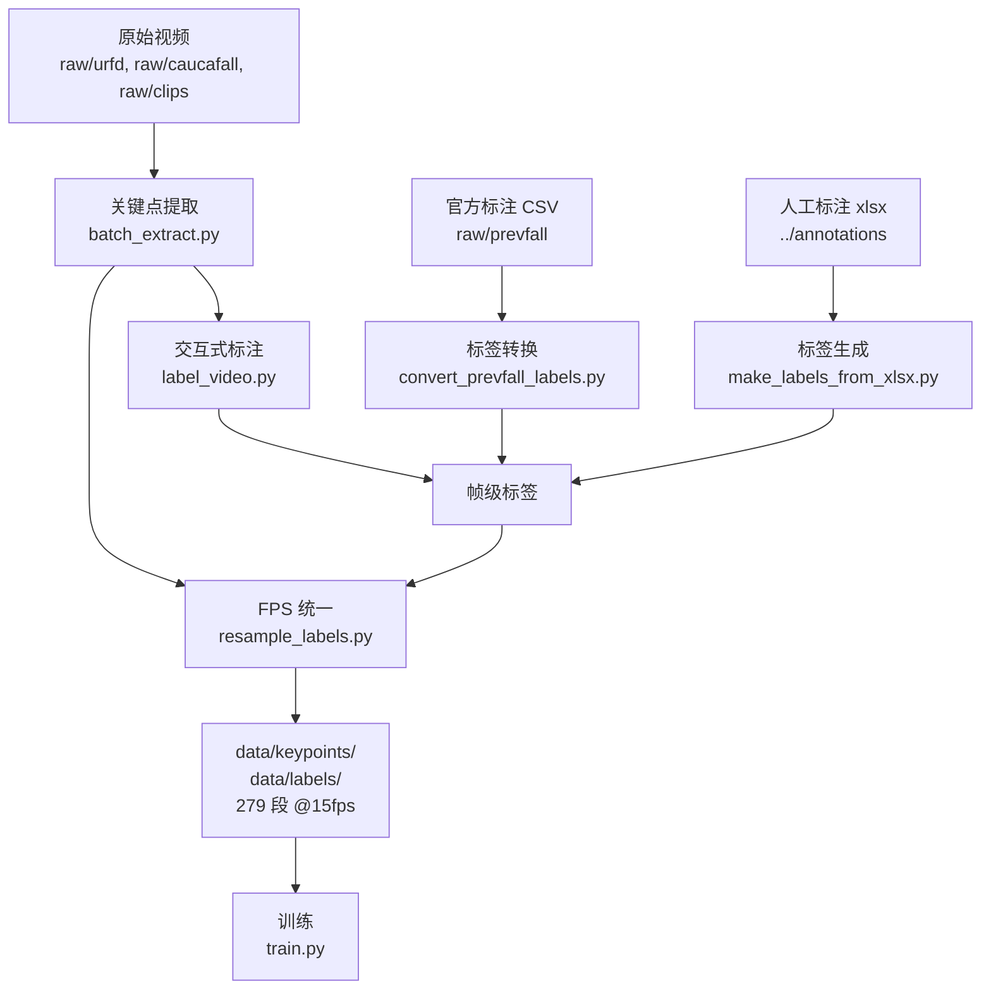

# data/ — 数据目录说明

本目录集中存放**关键点、标签、原始视频与实验中间产物**。

> ⚠️ **所有大体积文件（`*.npy`、`*.mp4`、`*.avi`、`data/raw/**`）均已加入 `.gitignore`，不会提交到仓库。**
> 克隆仓库后请按本文档的「再生成方式」重建数据。

---

## 一、目录总览

```text
data/
├── keypoints/                 ★ 训练用关键点 (N, 17, 3)，279 段
├── labels/                    ★ 训练用帧级标签 (N,)，279 段
│
├── raw/                       【原始视频与标注源文件】体积大，gitignore
│   ├── urfd/                  URFD 公开数据集（30 段）
│   ├── prevfall/              Pre-VFall 公开数据（3 个 CSV）
│   ├── caucafall/             CAUCAFall 居家场景视频（subject-1 ~ subject-6，72 个 mp4）
│   └── clips/                 自采短片（c / h / L / o 系列，170 个 avi）
│
└── variants/                  【中间版本 / 实验数据】
    ├── keypoints_caucafall/   仅 c/h/L/o 视频的关键点（173 个）
    ├── original/              FPS 重采样前的原始提取结果
    ├── resampled_30to15/      30fps → 15fps 重采样结果（108 对关键点/标签）
    ├── fps25/                 25fps 源的标签（171 个）与推理结果
    └── prevfall_keypoints_CGFM2.npy  单段校验样本（供 compare_keypoints.py 使用）
```

---

## 二、训练数据（`keypoints/` + `labels/`）

这是**模型实际使用的数据集**，由 `src/train.py` 直接读取。

| 项目 | 说明 |
|------|------|
| 规模 | 279 段视频 |
| 关键点形状 | `(N, 17, 3)` = (帧数, COCO 17 关节, [x, y, confidence]) |
| 标签形状 | `(N,)`，`int64`，`0=正常` / `1=失衡` / `2=摔倒` |
| 帧率 | 统一 **15fps**（原始 25 / 30fps 混合源已重采样对齐） |
| 归一化 | 髋居中 + 除身高（与推理端严格一致） |
| FPS 元数据 | **不存储**。FPS 只体现在帧数 N 上，滑窗 `window=30 @ 15fps ≈ 2 秒` |

### 命名规则

关键点文件 `<name>_keypoints.npy` 与标签文件 `<name>_labels.npy` **同名对应**，`<name>` 即视频名。

### 再生成方式

```bash
cd src

# 1. 提取关键点（可指定任意原始视频目录）
python batch_extract.py --dir ../data/raw  --exts mp4,avi

# 2. 生成标签（按数据集选一种）
python convert_prevfall_labels.py        # Pre-VFall CSV → 标签
python make_labels_from_xlsx.py          # xlsx 人工标注 → 标签
python label_video.py --video <video>    # 交互式逐帧标注

# 3. 统一帧率（关键点 + 标签同时间网格）
python resample_labels.py --orig_fps 30 --target_fps 15 --dry_run
python resample_labels.py --orig_fps 30 --target_fps 15
```

---

## 三、原始数据集（`raw/`）

### URFD

- **来源**：University of Rzeszow Fall Detection Dataset
- **规模**：本项目使用 30 段（官方含 30 段跌倒 + 40 段日常活动）
- **预处理**：原始为左右拼接画面（左半深度图 + 右半 RGB），用 `src/crop_urfd.py` 裁掉左半

```bash
cd src && python crop_urfd.py --all
```

### Pre-VFall

- **来源**：公开骨架关键点数据集
- **内容**：
  - `keypoints_no confidence.csv` — 逐帧 MPII 17 点坐标（抽帧，非全帧）
  - `gradient_direction.csv` / `gradient_magnitude.csv` — 梯度方向/幅值
- **转换**：`src/convert_prevfall_labels.py` 将抽帧标签**前向填充**到全帧率；
  `Normal` / `Abnormal` 段按视频合并，重叠帧取较高类别（宁可误报不可漏报）

### CAUCAFall

- **来源**：CAUCAFall 居家非受控环境数据集
- **内容**：`subject-1` ~ `subject-6`，每人为 5 类跌倒（前/后/左/右/坐倒）+ 5 类日常活动
- **特点**：场景贴近真实居家环境，是「失衡」中间态的重要来源

### clips（自采短片）

- **内容**：`c*` / `h*` / `L*` / `o*` 四个系列的短片（共 170 个 avi）
- **标注**：**人工逐帧标注**，源文件在 [`../annotations/`](../annotations/README.md)
  - 标注格式：`视频名 | 起始帧 状态 | 起始帧 状态 | ...`（状态 `0=正常 1=不分正常 2=摔倒`，起始帧为 1-based）
  - 转换：`python src/make_labels_from_xlsx.py`

---

## 四、实验中间产物（`variants/`）

这些目录**不参与训练**，仅用于回溯实验过程与问题排查。

| 目录 | 说明 |
|------|------|
| `original/` | FPS 重采样**之前**的原始提取结果，用于对比重采样前后帧数变化 |
| `resampled_30to15/` | 30fps → 15fps 重采样结果（108 对），用于验证时间网格对齐正确 |
| `fps25/` | 25fps 源视频的标签与推理结果，与 30fps 批次分开处理 |
| `keypoints_caucafall/` | 仅 c/h/L/o 视频的关键点，故障隔离排查用 |
| `prevfall_keypoints_CGFM2.npy` | 单段样本，`src/compare_keypoints.py` 用它校验 MPII ↔ COCO 坐标转换是否正确 |

---

## 五、数据流水线



---

## 六、常见问题

| 问题 | 解决 |
|------|------|
| `data/keypoints` 是空的 | 数据被 gitignore，需按「再生成方式」重新提取，或从备份恢复 |
| 标签与关键点帧数不一致 | 运行 `resample_labels.py` 对齐；或检查是否漏跑重采样 |
| 关键点文件数量少于视频数量 | `batch_extract.py --exts` 默认只处理 `mp4`，处理 avi 需显式指定 `--exts mp4,avi` |
| 无法判断是哪一批数据 | 查看 `variants/original` 与 `variants/resampled_30to15` 的帧数差异定位所处阶段 |
